# AI Workflow

A Codex-only Plugin that runs one software feature through pinned Matt Pocock-derived engineering methods, Project Contract safety, GitHub specification and tickets, two-agent implementation and quality, and explicitly approved pull-request delivery.

## Workflow

```mermaid
flowchart LR
    P["Repository setup preflight"] --> C["Project Contract"]
    C --> W["Workspace Gate"]
    W --> G["$grill-with-docs"]
    G --> S["$to-spec"]
    S -->|"Specification Gate"| PI["GitHub parent issue"]
    PI --> T["$to-tickets"]
    T -->|"Ticket Breakdown Gate"| TI["GitHub sub-issues"]
    TI --> I["Implementation Agent"]
    TI --> Q["Quality Agent"]
    I --> R["Ticket verify + $code-review"]
    Q --> R
    R -->|"passed"| K["Controller ticket commit"]
    R -->|"owned findings"| I
    K -->|"more tickets"| I
    K -->|"all tickets"| F["Feature verify + review"]
    F --> D["Delivery Gate"]
    D --> PR["Push + pull request"]
```



The public controller is `$ai-workflow`. The methods remain independently invokable:

```text
$setup-matt-pocock-skills
$grill-with-docs
$grilling
$domain-modeling
$to-spec
$to-tickets
$implement
$tdd
$code-review
```

`$triage`, GitLab, Linear, Jira, local-Markdown tracker execution, multi-ticket parallelism, automatic merge, and direct issue closure are outside this release.

## Install at USER scope

Ask the built-in installer to review and install the complete set from one commit:

```text
$skill-installer Install exactly these Skill paths from
https://github.com/pong1013/ai-workflow into my USER skill scope:

skills/ai-workflow
skills/code-review
skills/domain-modeling
skills/grill-with-docs
skills/grilling
skills/implement
skills/setup-matt-pocock-skills
skills/tdd
skills/to-spec
skills/to-tickets

Review and pin one source commit for the complete set first.
Review the Matt Pocock provenance and adaptations in UPSTREAM.md.
Do not modify the current repository.
Use one multi-path installer invocation with that pinned ref and a temporary
staging destination. Validate all 10 staged Skills before changing USER scope.
Preflight all 10 final destinations and stop before promotion if any exists.
If a legacy ship-feature Skill exists, move only that directory to a clearly
named recoverable backup outside the live USER skills directory (for example,
$CODEX_HOME/skill-backups/ship-feature-<timestamp>) after staging succeeds and
before promotion; stop if the backup target exists. Promote the complete staged
set. If promotion or final validation fails, remove only the newly promoted
paths from this attempt and restore the legacy directory from that backup.
Verify every installed file matches the reviewed source.
```

Installation makes the Skills available globally. It does not configure or modify the repository that happens to be open.

The legacy migration instruction is intentionally explicit: without it, the removed `$ship-feature` controller could remain discoverable beside `$ai-workflow`. The local runner exercises this staged, recoverable migration; installation from a public commit is still a separate release gate.

## Configure each repository once

In each repository, explicitly run:

```text
$setup-matt-pocock-skills
```

The setup Skill inspects remotes, repository instructions, domain docs, and ADRs; previews `docs/agents/issue-tracker.md`, `docs/agents/domain.md`, and bounded `AGENTS.md`/`CLAUDE.md` changes; then waits for confirmation before writing. The preview emits a plan token, and apply refuses any changed file set, content, option, or fetch/push remote until the new diff is approved. It validates and shows the diff but never commits or pushes.

This release of `$ai-workflow` requires the resulting tracker configuration to select GitHub. A valid GitLab or Local Markdown setup remains truthful configuration, but `$ai-workflow` stops at the Exception Gate because those execution paths are unsupported. Jira, Linear, and other custom tracker configurations are not accepted by this release's setup contract.

## Run or resume

Start a new full Feature Run:

```text
$ai-workflow Add team invitations with expiring email links.
```

Stop or resume naturally:

```text
$ai-workflow Start this feature and stop after Grill.
$ai-workflow Continue from GitHub spec #123.
$ai-workflow Continue from the existing tickets for #123.
```

New features always pass through Grill, which may finish immediately when no consequential decision remains. Resume from a specification or tickets requires current approval provenance or a fresh Resume Gate.

One Codex task owns one unfinished Feature Run. Run different features in different tasks and isolate their branches or worktrees when edits could overlap.

## Repository integration

The workflow reads:

- `docs/agents/issue-tracker.md` for tracker identity and operations;
- `docs/agents/domain.md` for domain-document layout;
- `.agents/project-contract.md` for verification, workspace, artifacts, and delivery;
- applicable `AGENTS.md`, `CLAUDE.md`, `CONTEXT.md`, `CONTEXT-MAP.md`, and ADRs.

If Matt setup is missing, `$ai-workflow` stops before creating a Feature Run. If the Project Contract is missing, it performs Contract Discovery and obtains approval before persistence.

GitHub stores the canonical parent specification and ticket sub-issues. Ignored `.agents/runs/<feature-id>.json` files store disposable local controller checkpoints. Losing a checkpoint does not lose the work facts; an explicit GitHub parent issue can reconstruct the run, but old approvals are not silently restored.

## Gates and delivery

- **Setup Confirmation Gate:** authorizes only the displayed per-repository setup files.
- **Workspace Gate:** authorizes the displayed branch/worktree or ownership change.
- **Contract Persistence Gate:** authorizes only the displayed Project Contract.
- **Specification Gate:** approves and publishes one exact GitHub parent issue.
- **Ticket Breakdown Gate:** approves and publishes the exact ticket set and blocker graph.
- **Exception Gate:** resolves new consequential decisions, conflicts, missing capability, unsafe state, or a loop with no new evidence.
- **Delivery Gate:** authorizes only the displayed branch push and pull-request creation. Approval enters `delivery-approved`; the run becomes complete only after both operations succeed.

`$implement` never commits. After each ticket passes independent verification and review, the controller creates one local commit referencing the ticket. Issues stay open throughout local work and pull-request review; closing references take effect only when the pull request merges.

## Implementation plan

The approved scope, sequence, acceptance criteria, and cross-repository rollout are in [Full Workflow v1 Implementation Plan](docs/plans/full-workflow-v1.md).

## Possible future improvements

- Evaluate whether a unified `$setup-ai-workflow` command materially simplifies per-repository onboarding. The current design already combines `$setup-matt-pocock-skills` with Project Contract discovery at runtime, so this is not a promised next-version feature.
- Evaluate a separate quick workflow only after the complete GitHub path is proven end to end.

## Development

```bash
python3 -m pip install --requirement requirements-dev.txt
make verify
make canonical-validate
```

`make verify` covers deterministic Plugin, Skill, provenance, state/authority, link, and negative-fixture checks. [Behavioral scenarios](evals/scenarios.md) and the [integration matrix](evals/integration-matrix.md) require fresh-task and external evidence; deterministic success alone never means the Plugin is release-ready.

## License and provenance

MIT licensed. See [UPSTREAM.md](UPSTREAM.md) and [THIRD_PARTY_NOTICES.md](THIRD_PARTY_NOTICES.md) for the pinned Matt Pocock sources, adaptations, and license notice.
