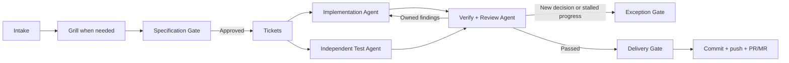

# AI Workflow

A Codex-only plugin that turns one `$ship-feature` invocation into a gated feature lifecycle. It discovers the current repository, recommends whether requirements need grilling, waits for specification approval, then drives tickets, parallel implementation and independent tests, verification, review, and explicitly approved delivery.

## Workflow



The user invokes only `$ship-feature`. Internal stages are references controlled by the same Workflow Controller, so approval replies advance the existing Feature Run without requiring another Skill invocation.

## Install at USER scope

From Codex, ask the built-in installer:

```text
$skill-installer Install the ship-feature workflow from
https://github.com/pong1013/ai-workflow/tree/main/skills/ship-feature
into my USER skill scope.
Review the source and dependencies first. Do not modify the current repository.
Stop if a conflicting skill already exists.
```

This repository also contains a Codex Plugin manifest for packaged distribution. Version 1 officially supports Codex only.

## Use

Start a complete Feature Run:

```text
$ship-feature Add team invitations with expiring email links.
```

Stop after an earlier stage or resume from an artifact. When the current Feature Run does not contain its approval, Codex shows a fresh Resume Gate before taking automatic actions:

```text
$ship-feature Clarify this design and stop after Grill.
$ship-feature Continue from docs/specs/team-invitations.md.
$ship-feature Continue from these approved tickets.
```

One Codex task owns one unfinished Feature Run. Start concurrent features in separate tasks and use separate branches or worktrees when edits may overlap.

## Repository integration

The controller first looks for `.agents/project-contract.md` in the current repository. The contract points to verification, knowledge, work artifacts, workspace policy, and delivery policy.

When no contract exists, the controller performs Contract Discovery from repository instructions, documentation, tooling, CI, existing artifacts, and Git configuration. It asks only for consequential unknowns and offers to persist the result; it never writes a contract without approval.

## Gates

- **Intake Gate:** Codex recommends Grill or a direct specification and the user confirms it; an explicit initial `start with grill` or `skip grill` directive already satisfies this gate unless repository evidence requires an exception.
- **Specification Gate:** approval authorizes scoped ticket creation and automatic implementation, testing, verification, and review.
- **Exception Gate:** a new decision, risk, conflict, missing capability, or stalled loop returns one evidence-backed question to the user.
- **Delivery Gate:** one exact bundle authorizes only the displayed stage, commit, push, and PR/MR operations.

## Development

```bash
python3 -m pip install --requirement requirements-dev.txt
make verify
```

Deterministic checks validate the Plugin, Skill frontmatter, Codex agent metadata, and workflow structure. Behavioral cases in [`evals/scenarios.md`](evals/scenarios.md) are forward-testing prompts and expected decision boundaries, not CI claims that model behavior is deterministic. [`evals/integration-matrix.md`](evals/integration-matrix.md) is the release gate for installation, fresh-task, multi-task, end-to-end delivery, and external integrations.

The state and authorization graph travels with the installable Skill in [`skills/ship-feature/references/state-machine.json`](skills/ship-feature/references/state-machine.json). `make verify` validates the pinned Plugin manifest contract, the exact v1 transition graph including rejected shortcut edges, all relative Markdown links, and negative fixtures.

The official validators remain an additional release gate. With the same pinned dependency installed, run:

```bash
python3 -m pip install --requirement requirements-dev.txt
make canonical-validate
```

## License and provenance

MIT licensed. The Grill stage is adapted from Matt Pocock's `grill-with-docs`, `grilling`, and `domain-modeling` workflows; see `THIRD_PARTY_NOTICES.md`.
